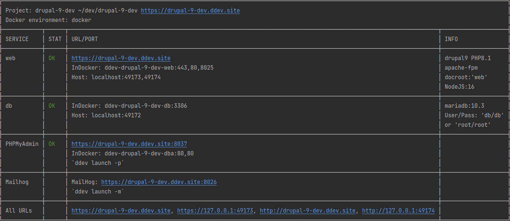

# drupal-ddev

**Requires at least PHPStorm 2022.2 because of this issue: https://youtrack.jetbrains.com/issue/WI-62463**

This is my personal development environment when working with Drupal. Created via the
`composer create-project drupal/recommended-project my_site_name_dir` command, see the drupal docs
for more info: https://www.drupal.org/node/2718229?no_cache=1651100340#s-create-a-project.

The [drupal/core-dev](https://packagist.org/packages/drupal/core-dev) package is included which
brings [phpcs](https://github.com/squizlabs/PHP_CodeSniffer), and [PHPUnit](https://phpunit.de) into the project.
[phpstan-drupal](https://github.com/mglaman/phpstan-drupal) is also included.

This repository is also some kind of resource collection for my self to quickly set up a development environment.

## Usage

This setup uses [ddev](https://ddev.readthedocs.io/en/stable/) to provide a webserver and database via docker compose.

To start the containers, run: `ddev start` <br/>
Stop: `ddev stop` <br/>
Import database dump: `ddev import-db --src=/path/to/db.sql.gz`

Use `ddev describe` to get detailed info about the services:



To get a list of all available commands, use `ddev -h`

For more see the [ddev CLI Docs](https://ddev.readthedocs.io/en/stable/users/cli-usage/).

### composer

Prefix all composer commands with `ddev`, eg. `ddev composer install`.

### drush

Prefix all drush commands with `ddev`, eg. `ddev drush cr`.

### PHPUnit

Configurations for PHPStorm are included. There is also a post-composer hook to automatically create a basic
phpunit.xml config file:

```
hooks:
  post-composer:
    - exec: ./.ddev/scripts/phpunit-config.sh
```

### Drupal configs

Drupal's configs are stored at /config.

The configs include a basic installation with the standard profile.

### ddev Hooks

This is the complete hooks section from the ddev config.yaml:

```
hooks:
  post-composer:
    # Create and configure PHPUnit config file
    - exec: ./.ddev/scripts/phpunit-config.sh
  post-start:
    # Install Drupal after start if not installed already
    - exec: "(drush status bootstrap | grep -q Successful) || echo '$settings[\'config_sync_directory\'] = \'./../config\';' >> web/sites/default/settings.php && drush site-install -y --db-url=mysql://db:db@db/db"
    # Generate a one-time login link for the admin account.
    - exec: "drush uli 1"
```

Besides the PHPUnit configuration (post-composer), there are also some kind of one-time installation routine living in
`post-start` section. This will check (every time you start the project) if Drupal is installed. If so, a one time login
link for user 1 is printed to the console via drush. If Drupal ist not already installed, it gets installed via
`drush site install` using the Drupal configs in `/config`.

## Pre-configuration

Includes necessary PHPStorm configs for:

* PHP CodeSniffer
* PHPStan Drupal
* PHP Interpreter via ddev (docker-compose)

## Resources

* [[Drupal.org] CodeSniffer](https://www.drupal.org/docs/contributed-modules/code-review-module/installing-coder-sniffer)
* [[ddev Docs] PhpStorm Integration](https://ddev.readthedocs.io/en/stable/users/topics/phpstorm/)
* [[ddev Docs] ddev Hooks](https://ddev.readthedocs.io/en/latest/users/configuration/hooks/)
* [[ddev Docs] ddev Commands](https://ddev.readthedocs.io/en/latest/users/extend/custom-commands/)
* [[ddev Docs] ddev Custom services](https://ddev.readthedocs.io/en/latest/users/extend/custom-compose-files/)
* [[Blocker] PHPStorm Bug](https://youtrack.jetbrains.com/issue/WI-62463)
* [[GitHub] drupal/core-dev](https://github.com/drupal/core-dev)
* [[mglaman.dev] PHPStan](https://mglaman.dev/blog/tighten-your-drupal-code-using-phpstan)
* [[mglaman.dev] Running Drupal's PHPUnit test suites on DDEV](https://mglaman.dev/blog/running-drupals-phpunit-test-suites-ddev)
* [[mglaman.dev] Running Drupal's FunctionalJavascript tests on DDEV](https://mglaman.dev/blog/running-drupals-functionaljavascript-tests-ddev)
* [[mglaman.dev] Running Drupal's Nightwatch test suite on DDEV](https://mglaman.dev/blog/running-drupals-nightwatch-test-suite-ddev)
* [[Drupal.org] PHPUnit in Drupal](https://www.drupal.org/docs/automated-testing/phpunit-in-drupal)
* [[Drupal.org] Running PHPUnit tests](https://www.drupal.org/docs/automated-testing/phpunit-in-drupal/running-phpunit-tests)
* [[drush.org] Drush commands](https://www.drush.org/latest/commands/all/)

## Upgrade to Drupal 10

### Preparation

https://www.drupal.org/docs/upgrading-drupal/upgrading-from-drupal-8-or-later/upgrading-from-drupal-9-to-drupal-10/overview

### Upgrade

https://www.drupal.org/docs/upgrading-drupal/upgrading-from-drupal-8-or-later/upgrading-a-composer-based-site

```
ddev composer require 'drupal/core-recommended:^10' 'drupal/core-composer-scaffold:^10' 'drupal/core-project-message:^10' --update-with-dependencies --no-update
ddev composer require 'drupal/core-dev:^10' --dev --update-with-dependencies --no-update
ddev composer update
```

## Credits

Thanks to Matt Glaman for the webdriver container (https://mglaman.dev/blog/running-drupals-functionaljavascript-tests-ddev).
